# Image_Segmentation
* About Implementation and testing of computer vision image segmentation algorithms

* This project consists of 3 modules:  
    1-**main.ipynb**  : main program  

    2-**main.py** : Pyqt GUI script  

    3-**ThreTechniques.py**: contains the implementation of the Three ways of threshold  Optimal, Otsu and spectral. 

    4-**threshold.py** : contains the implementation of the local and global thresholding as general functions to be used in **ThreTechniques.py** to apply global and local for optimal, otsu and spectral.

    5-**RGB_to_LUV.py** : contains the implementation of conversion RGB image to LUV

    6-**region_growing.py** : contains the implementation of region growing algorithm

    7-**meanShift.py** : contains the implementation of mean shift algorithm 

    8-**Kmeans.py** : contains the implementation of the kmean algorithm

    9-**Agg.py** : contains the implementation of agglomerative method

------
  # Libraries Versions 

  - cv2 : version 4.5.5.64
  - matplotlib : version 3.3.4
  - scipy :  version 1.6.2
  - numpy :  version 1.22.2

  ------

# To open UI 

- main file name is main.py.

- if you want to apply thresholding (choose Thresholding Techniques tab from UI)

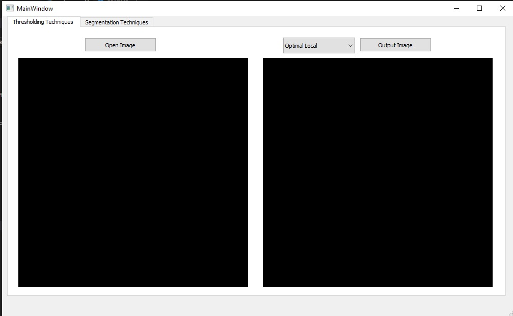

- Similarily. if you want to apply segmentation (choose Segmantation technique tab from UI)

- choose suitable image from folder images as input image (according to method you want to be showed the image name is same as method name)
- choose from combobox the algorithm you want to apply after selecting suitable image.

Example : 
- To apply local optimal (From threshold techniques tab) : 

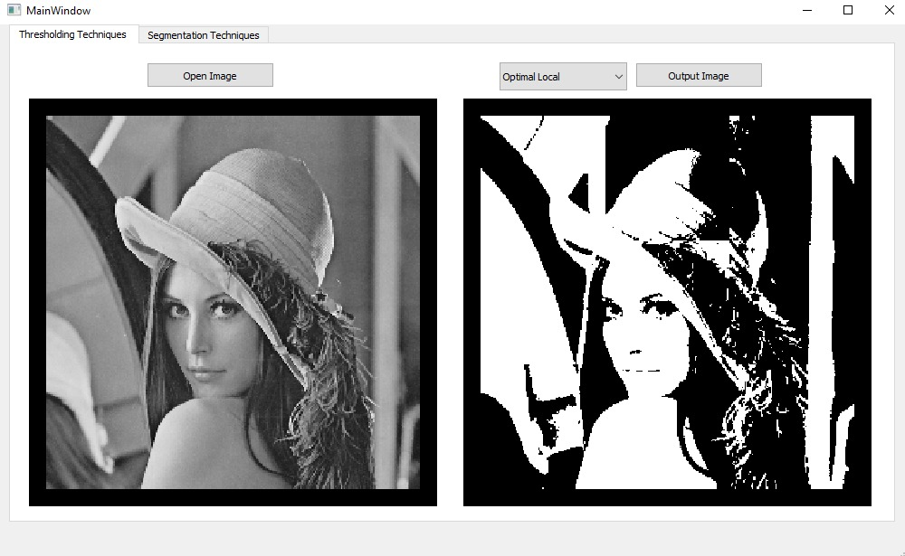

 - To apply local Otsu (From threshold techniques tab): 

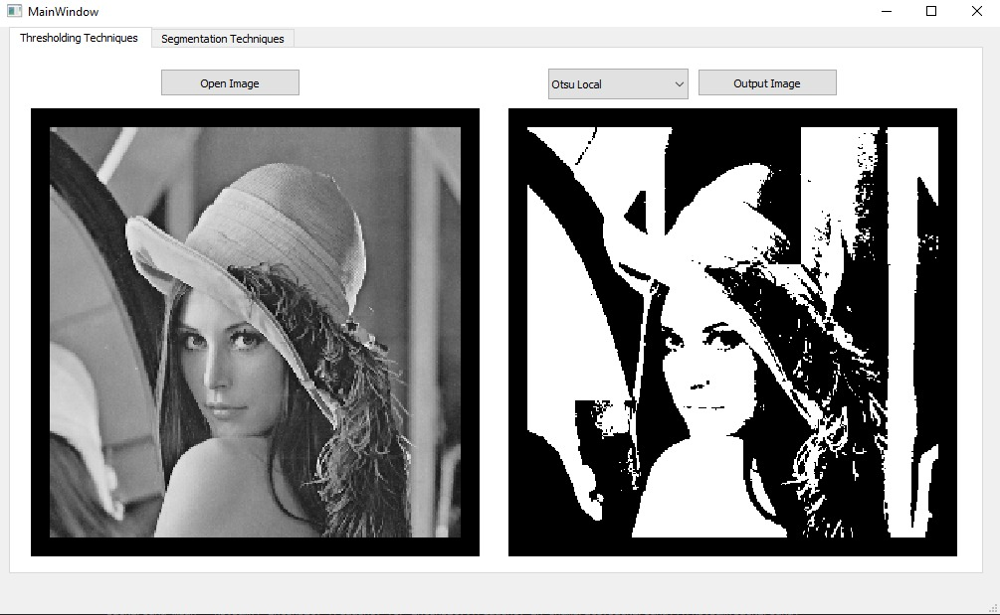

- To apply Global Otsu (From threshold techniques tab): 

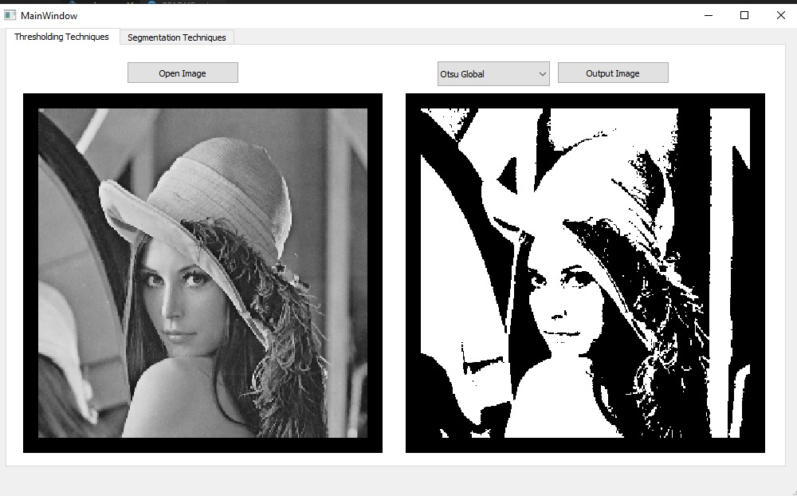

- To apply Global Optimal (From threshold techniques tab): 

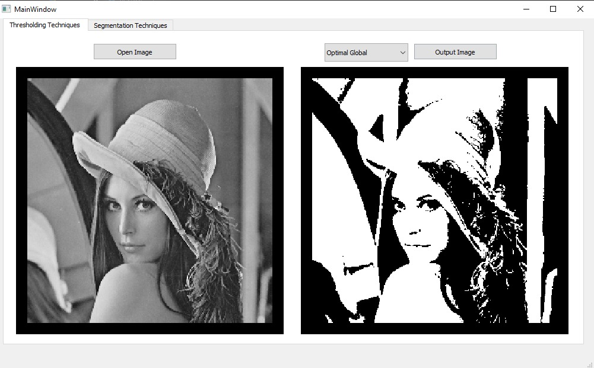

- To apply MeanShift (From segmentation techniques tab) : 

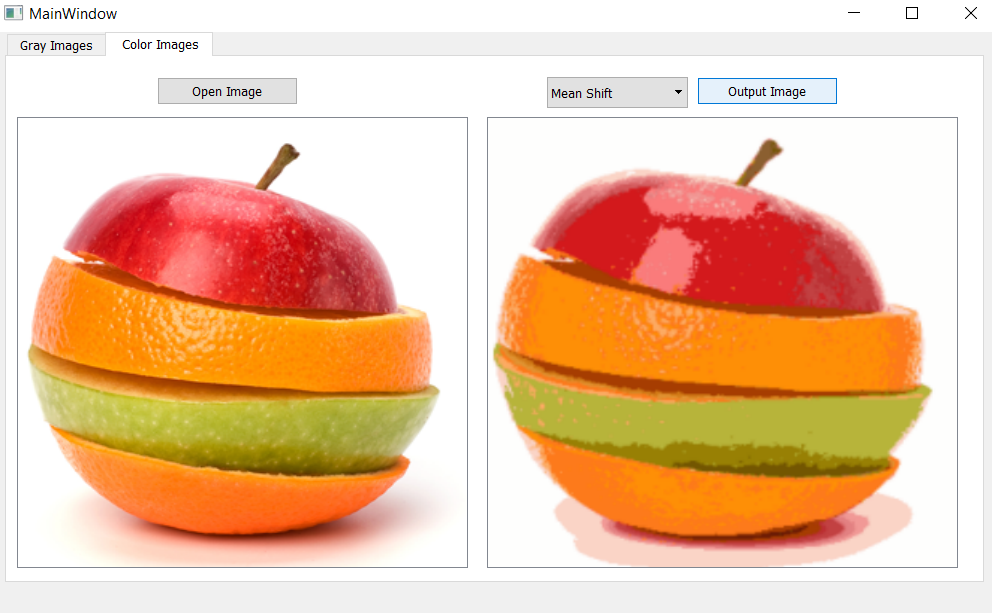

# Note : UI may be got (not responding) during runnig, So if you want to see results clearly, you will get all of them in **main.ipynb** .

# Task Content ::
- The task consists of two subtasks : Thresholding & segmentation  

## 1- Thresholding:
In computer vision,  thresholding  is a fundamental tool for segmentation  of  grey level images when  objects and background pixels can be distinguished by  their grey level values.

A- **Optimal Threshold**:

 - used to separate the object and background pixels of the image to improve the quality of low contrast images
### Results :
- Original image

  

- After Applying Global optimal threshold

  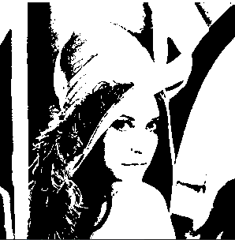
  

- After Applying local optimal threshold

  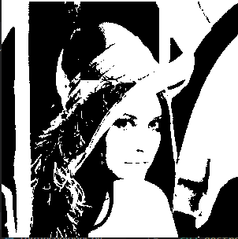
 
  ---------------

B- **Otsu Threshold**:

- is used to perform automatic image thresholding.In the simplest form, the algorithm returns a single intensity threshold that separate pixels into two classes, foreground and background. This threshold is determined by minimizing intra-class intensity variance, or equivalently, by maximizing inter-class variance. Otsu's method is a one-dimensional discrete analog of Fisher's Discriminant Analysis.

### Results :
- Original image

  

- After Applying Global Otsu threshold

  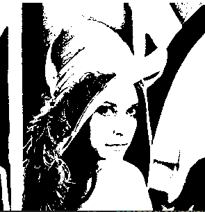
  

- After Applying local Otsu threshold

  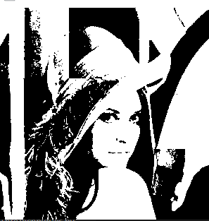

C- **Spectral Threshold**:

- spectral (or multilevel) threshold is proposed for segmenting an image into multiple levels using its mean and variance. Starting from the extreme pixel values at both ends of the histogram plot, the algorithm is applied recursively on sub-ranges computed from the previous step, so as to find a threshold level and a new sub-range for the next step, until no significant improvement in image quality can be achieved. 

### Results :

- Original image

  

- After Applying Global Spectral threshold

  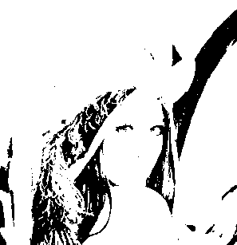
  

- After Applying local Spectral threshold

  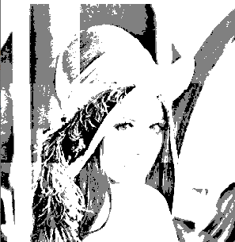

--------------------------------------

## Conversion from RGB to LUV :

- We need this step to be applied in segmentation.

- Original image

  

  

- After Applying luv conversion

  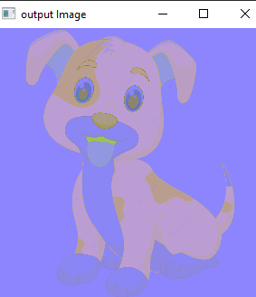

- The result from luv builin in in cv2

  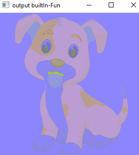
-------------
## 2- Segmentation:

A- **K-Mean**:

is an unsupervised algorithm and it is used to segment the interest area from the background. But before applying K -means algorithm, first partial stretching enhancement is applied to the image to improve the quality of the image. Subtractive clustering method is data clustering method where it generates the centroid based on the potential value of the data points. So subtractive cluster is used to generate the initial centers and these centers are used in k-means algorithm for the segmentation of image. 

- Original image

  

- After Segmentation

  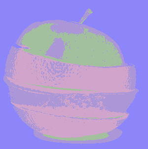

B- **Mean Shift** :

Mean shift clustering algorithm is a centroid-based algorithm that helps in various use cases of unsupervised learning. It works by shifting data points towards centroids to be the mean of other points in the region. It is also known as the mode seeking algorithm. The algorithm’s advantage is that it assigns clusters to the data without automatically defining the number of clusters based on defined bandwidth.

### Results :

- Original image

  

- After Segmentation
  
  (No of clusters here is 27)

  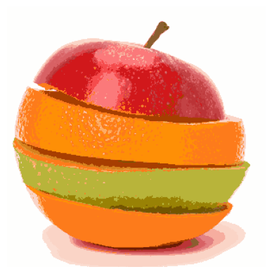

C- **Agglomerative method** :
- Agglomerative Clustering is a type of hierarchical clustering algorithm. It is an unsupervised machine learning technique that divides the population into several clusters such that data points in the same cluster are more similar and data points in different clusters are dissimilar.
- Points in the same cluster are closer to each other.
- Points in the different clusters are far apart.

- Steps of Agglomerative Clustering:

    1- Initially, all the data-points are a cluster of its own.

   2- Take two nearest clusters and join them to form one single cluster.

   3- Proceed recursively step 2 until you obtain the desired number of clusters.

### Results :
 (here we use small image size (50x50) beacuse og long computation time)

- Original image

  

- After Segmentation

  

D- **Region growing** :

- Region growing is a simple region-based image segmentation method. It is also classified as a pixel-based image segmentation method since it involves the selection of initial seed points.
This approach to segmentation examines neighboring pixels of initial seed points and determines whether the pixel neighbors should be added to the region.
- The first step in region growing is to select a set of seed points. Seed point selection is based on some user criterion (for example, pixels in a certain grayscale range, pixels evenly spaced on a grid, etc.).The initial region begins as the exact location of these seeds.The regions are then grown from these seed points to adjacent points depending on a region membership criterion. The criterion could be, for example, pixel intensity, grayscale texture, or colour.
Since the regions are grown on the basis of the criterion, the image information itself is important. For example, if the criterion were a pixel intensity threshold value, knowledge of the histogram of the image would be of use, as one could use it to determine a suitable threshold value for the region membership criterion.

### Results :

- Original image

  

- After Segmentation

  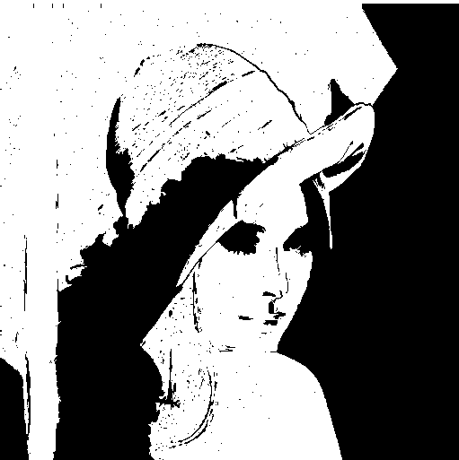

----------------------------

# Ui Screenshots :
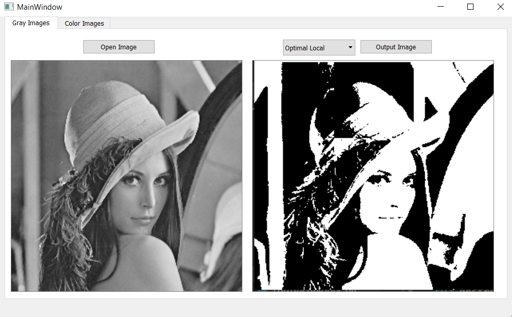
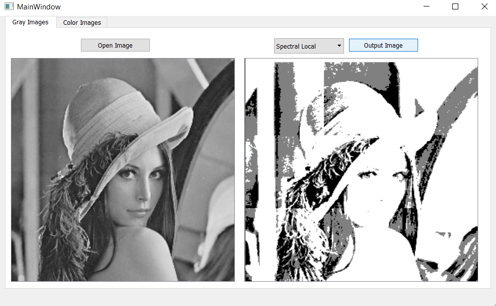

------------------------------

# Computation Time :

### Thresholding
----

- Optimal

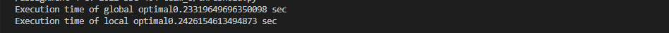

- Otsu 

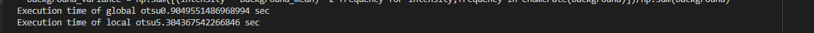

- Spectral 
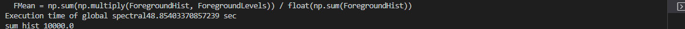
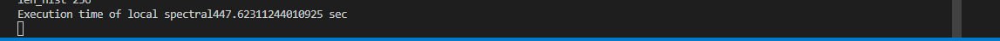

-------
### Segmentation
-----
- K- Mean

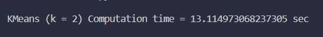
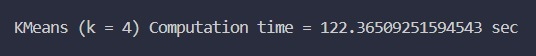

- MeanShift

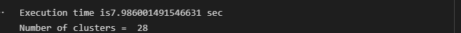

- Agglomerative 

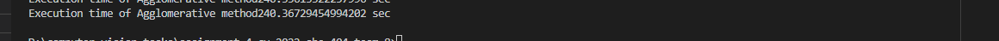

- Region growing

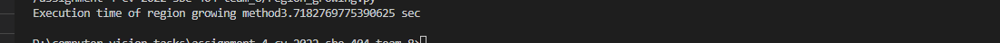

### Note : Agglomerative method takes long time to compute, so we use small image as input (that is the reason of appearing pixels in image. )